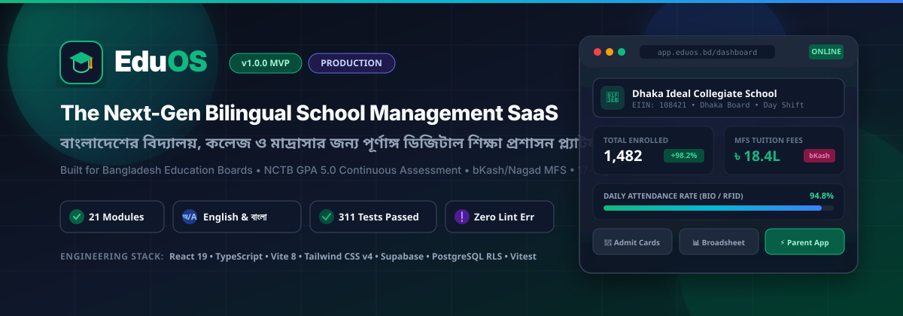
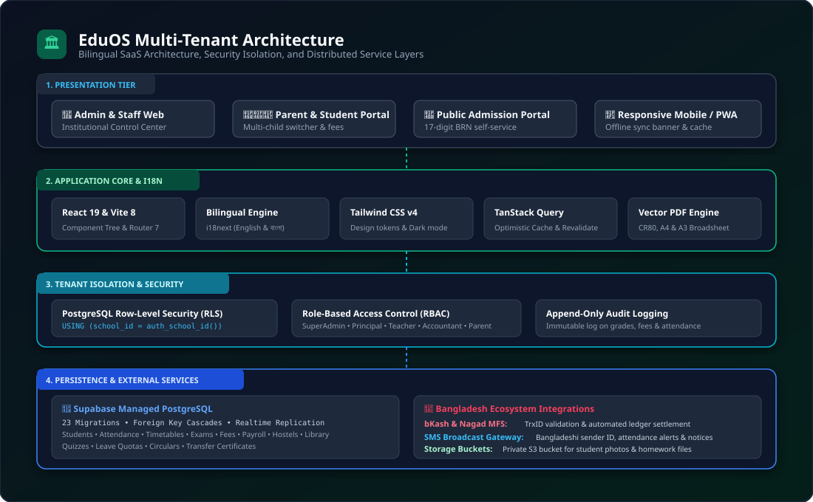
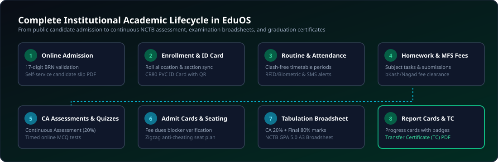
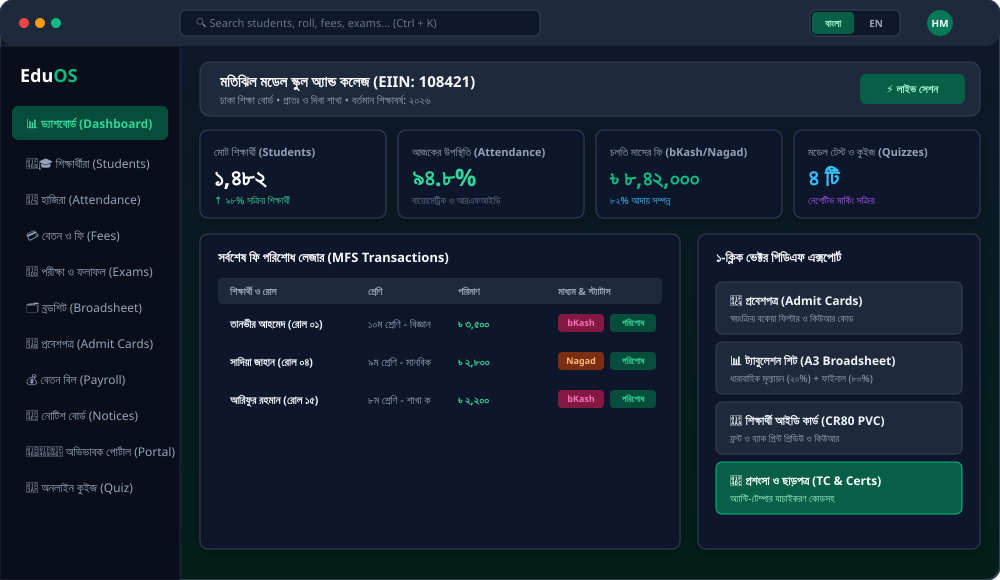
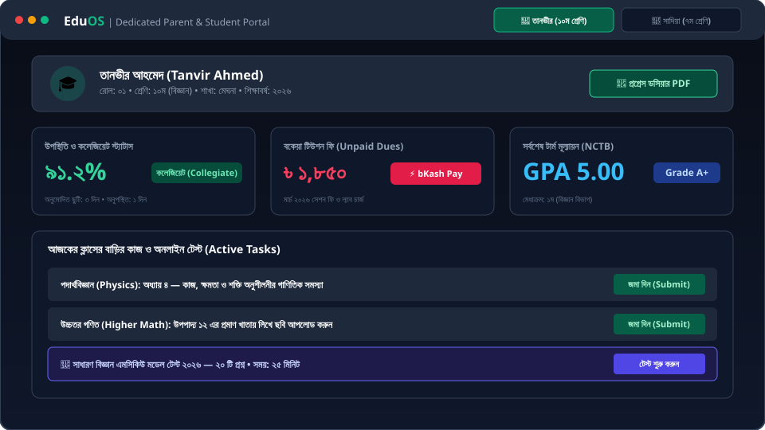
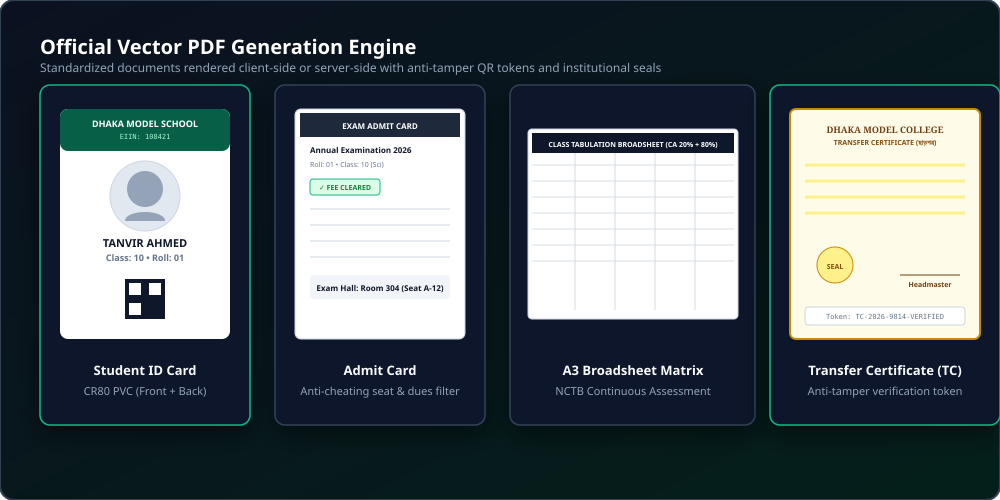

<div align="center">



# EduOS (এডু ওএস)
### The Next-Generation Bilingual Multi-Tenant School Management SaaS for Bangladesh
**বাংলাদেশের বিদ্যালয়, কলেজ ও মাদ্রাসার জন্য সমন্বিত আধুনিক শিক্ষাপ্রতিষ্ঠান প্রশাসন ও অটোমেশন প্ল্যাটফর্ম**

[](https://github.com/farazrasul0-cmd/EduOS/releases)
[](https://github.com/farazrasul0-cmd/EduOS/actions)
[](https://github.com/farazrasul0-cmd/EduOS)
[-0284c7?style=for-the-badge)](./src/i18n)
[](./src/lib/utils.ts)
[](./LICENSE)

<br/>

[🚀 Quick Start](#-quick-start--local-development) •
[🏛️ System Architecture](#-system-architecture) •
[🔄 Academic Lifecycle](#-institutional-academic-lifecycle) •
[📚 21 Core Modules](#-21-core-operational-modules) •
[🖼️ UI Showcase](#-user-interface-showcase) •
[🛡️ Security & RLS](#-security--tenant-isolation) •
[📄 Vector PDF Engine](#-vector-pdf-generation-engine) •
[📖 Documentation](./docs)

</div>

---

## 🌟 Why EduOS? (কেন এডু ওএস?)

EduOS is not a generic school template; it is purpose-built from the ground up to solve the exact operational, financial, regulatory, and linguistic challenges faced by **schools, colleges, and madrasahs across Bangladesh**:

- **🇧🇩 100% Bangladesh National Curriculum (NCTB) Compliant**:
  - Continuous Assessment (**CA 20%**) + Summative Final Examination (**80%**) weighting.
  - Government NCTB **GPA 5.0** grading scale ($A+, A, A-, B, C, D, F$) with automatic fail-cutoff handling.
  - Full-class **A3 Landscape Tabulation Broadsheets** for official Education Board archives.
- **💳 Native Mobile Financial Services (bKash & Nagad)**:
  - Instant TrxID verification and automated student tuition ledger settlement.
  - Automatic fee dues filter that halts admit card generation for defaulters.
- **🌐 100% Bilingual Parity (English & বাংলা)**:
  - Complete key-for-key translation coverage across every screen, form, alert, and report.
  - Native Bengali numeral formatting (১, ২, ৩) and Bangladeshi Taka (`৳`) currency representation.
- **🆔 Verified National Student Identification**:
  - Algorithmic validation for Bangladeshi **17-digit Birth Registration Numbers (BRN)**.
  - Standard **CR80 PVC Student ID Cards** and **Admit Cards** with dynamic QR verification.
- **🏫 Institutional Multi-Tenancy with EIIN**:
  - Complete data isolation per school using PostgreSQL **Row-Level Security (RLS)**.
  - Built-in support for all 10 Bangladesh Education Boards + Madrasah & Technical Boards.
  - Shift management (Morning / Day / Double shift) and medium support (Bangla / English Version / Dakhil).
- **📶 Offline-Resilient Experience**:
  - Network disconnection detector banner with cached client states and seamless revalidation.

---

## 🏛️ System Architecture

EduOS is engineered with a modern multi-tier decoupled architecture designed for high scalability, bulletproof tenant isolation, and zero-downtime operations:

<div align="center">
  
</div>

### Architectural Highlights:
1. **Client Presentation Tier**:
   - **Modern Stack**: React 19, TypeScript, Vite 8, Tailwind CSS v4 design tokens, React Router 7.
   - **Dedicated Portals**: Administrative Console, Dedicated Parent & Student Portal, and Public Candidate Admission Portal.
2. **Application Core & Domain Layer**:
   - **Caching & State**: TanStack Query v5 with optimistic updates and background revalidation.
   - **Engines**: Continuous Assessment calculator, anti-clash routine generator, online MCQ test runner with negative marking, and vector PDF compilers.
3. **Security & Persistence Tier**:
   - **Database**: Supabase Managed PostgreSQL 16 with 23 ordered migration scripts.
   - **Tenant Isolation**: Row-Level Security (RLS) enforced at the database engine level via `school_id = auth_school_id()`.
   - **Audit Trail**: Immutable append-only logging for sensitive operations (grades, fees, attendance).
4. **Bangladesh Ecosystem Layer**:
   - **MFS**: bKash & Nagad mobile wallet validation and reconciliation.
   - **SMS Gateway**: Mock & live adapters for Bangladeshi telecom sender IDs.

---

## 🔄 Institutional Academic Lifecycle

EduOS orchestrates every stage of the academic journey from a child's initial admission application to their final graduation certificate:

<div align="center">
  
</div>

---

## 🖼️ User Interface Showcase

### 1. Administrative Control Center & Live Dashboard
The administrative cockpit provides principals and administrators with real-time operational insights, daily attendance rates, tuition billing summaries, and quick PDF generation actions:

<div align="center">
  
</div>

### 2. Dedicated Parent & Student Portal (`/portal`)
Guardians can seamlessly monitor collegiate standing, view class timetables, submit homework, attempt model tests, and pay monthly tuition fees via bKash with a single click:

<div align="center">
  
</div>

### 3. Vector PDF Generation Engine
EduOS generates publication-grade, vector-crisp documents ready for physical printing on standard paper and PVC plastic:

<div align="center">
  
</div>

---

## 📚 21 Core Operational Modules

EduOS v1.0.0 delivers 21 fully integrated, production-ready modules:

| # | Module | Key Capabilities & Features | Primary Roles | Official Export |
| :-: | :--- | :--- | :--- | :--- |
| **01** | **Core SaaS & App Shell** | Bilingual toggle, dark/light themes, offline sync banner, global search (`Ctrl+K`) | All Users | - |
| **02** | **Institution Onboarding** | EIIN validation, Board selector (Dhaka, Madrasah, etc.), Morning/Day shifts | SuperAdmin | Institutional Profile |
| **03** | **Student Directory** | 17-digit BRN validation, guardian contacts, batch CSV import & export | Admin / Teachers | Student Roster CSV |
| **04** | **Attendance Management** | RFID/Biometric compatible, daily rosters, defaulter detection ($<75\%$) | Teachers / Admin | Monthly Attendance Sheet PDF |
| **05** | **Class Routine Scheduler** | Automated conflict-free slot allocation, teacher & room clash detection | Principal / Teachers | A4 Class Routine Matrix PDF |
| **06** | **Homework & Assignments** | Subject assignments, submission repository, teacher feedback & grading | Teachers / Students | Assignment Task Sheet |
| **07** | **Tuition Fees & MFS** | bKash & Nagad MFS reconciliation, arrears tracking, dues calculator | Accountant / Parents | Vector Payment Receipt PDF |
| **08** | **NCTB Results & Grading** | Continuous Assessment (20%) + Final (80%), GPA 5.0 scale, merit rankings | Teachers / Principal | Academic Transcript & Report Card |
| **09** | **Exam Routine Scheduler** | Chronological exam matrix, room capacity allocation, invigilator duty list | Exam Controller | A4 Exam Routine PDF |
| **10** | **Student ID Card Studio** | Standard CR80 PVC format (front & back), student photos, dynamic QR codes | Admin Staff | Batch CR80 PVC ID Cards PDF |
| **11** | **Public Admission Portal** | External applicant portal, 17-digit birth certificate check, application fees | Candidates / Parents | Admission Confirmation Slip PDF |
| **12** | **Library Management** | Dewey Decimal Classification, book inventory, loan tracker, overdue fines | Librarian | Library Borrower Slip PDF |
| **13** | **Staff & Teacher Payroll** | Basic pay, allowances, Provident Fund deductions, Tax TDS, disbursement ledger | Accountant / Principal | Vector A4 Salary Payslip PDF |
| **14** | **Certificates & Attestation**| Transfer Certificate (TC), Character Certificate, anti-tamper token system | Headmaster / Admin | Verified Official Certificate PDF |
| **15** | **Hostel & Dormitory** | Building, floor, room, and bed allocation, meal mess tokens, gate pass curfew | Hostel Warden | Room Roster & Gate Pass PDF |
| **16** | **Admit Cards & Seating** | Automatic fee dues filter, anti-cheating zigzag exam hall seating | Exam Controller | Verified Student Admit Card PDF |
| **17** | **Tabulation Broadsheet** | Full-term broadsheet displaying CA + CQ + MCQ + Practical scores | Exam Committee | Vector A3 Landscape Broadsheet |
| **18** | **Leave Management** | Casual, medical & earned quotas, multi-role approval, attendance sync | Admin / Teachers | Leave Approval Dossier PDF |
| **19** | **Digital Notice Board** | Categorized circulars (Academic, Exam, Urgent), SMS broadcast dispatcher | Principal / Admin | Official Notice Circular A4 PDF |
| **20** | **Parent & Student Portal** | Multi-child switcher, collegiate status indicator, 1-click bKash payment | Parents / Students | Student Progress Dossier PDF |
| **21** | **Online MCQ Quiz Engine** | Live timed test runner, negative marking (-0.25/-0.50), NCTB question banks | Teachers / Students | Diagnostic Performance Analysis PDF |

*For in-depth module specifications, see [docs/MODULES.md](./docs/MODULES.md).*

---

## 👥 Role-Based Access Control (RBAC)

EduOS enforces strict role boundaries across 6 institutional user personas:

| Capability / Module | Super Admin | Principal / Headmaster | Teacher | Accountant | Parent / Guardian | Student |
| :--- | :---: | :---: | :---: | :---: | :---: | :---: |
| **Institutional Setup & EIIN** | ✅ | ✅ | ❌ | ❌ | ❌ | ❌ |
| **Student Profiles & Roster** | ✅ | ✅ | ✅ | Read Only | ❌ | ❌ |
| **Mark Class Attendance** | ✅ | ✅ | ✅ | ❌ | ❌ | ❌ |
| **Class Timetable Management** | ✅ | ✅ | Read Only | ❌ | Read Only | Read Only |
| **Tuition Invoicing & bKash Ledger**| ✅ | ✅ | ❌ | ✅ | Pay Dues | Read Only |
| **CA & Final Marks Entry** | ✅ | ✅ | ✅ | ❌ | ❌ | ❌ |
| **Class Tabulation Broadsheet**| ✅ | ✅ | ✅ | ❌ | ❌ | ❌ |
| **Admit Card Generation** | ✅ | ✅ | ❌ | Fee Filter | Download | Download |
| **Staff Payroll & TDS** | ✅ | ✅ | View Own | ✅ | ❌ | ❌ |
| **Transfer Certificate (TC)** | ✅ | ✅ (Sign) | ❌ | Clearance | ❌ | ❌ |
| **Online MCQ Quiz Engine** | ✅ | ✅ | Create | ❌ | View Result | Attempt Test |
| **Multi-Child Switcher** | ❌ | ❌ | ❌ | ❌ | ✅ | ❌ |

---

## 🛡️ Security & Tenant Isolation

EduOS guarantees enterprise-grade security for institutional data:

1. **Row-Level Security (RLS)**:
   - Every multi-tenant database table enforces `school_id = auth_school_id()`.
   - Cross-tenant data leakage is physically impossible even under malicious client queries.
2. **Append-Only Audit Logs**:
   - High-consequence mutations (marks changes, fee waivers, attendance revisions) record the actor, timestamp, prior state, and new state into immutable audit tables.
3. **Anti-Tamper Verification Tokens**:
   - Certificates and Admit Cards feature unique cryptographic tokens and dynamic QR codes that can be scanned for instant authenticity verification.

*For complete security details, review [SECURITY.md](./SECURITY.md).*

---

## 🚀 Quick Start & Local Development

### Prerequisites
- **Node.js**: `v20.x`, `v22.x`, or `v24.x`
- **npm**: `v10+`
- **Git**

### Installation

```bash
# 1. Clone the repository
git clone https://github.com/farazrasul0-cmd/EduOS.git
cd EduOS

# 2. Install dependencies
npm install

# 3. Setup environment configuration
cp .env.example .env

# 4. Launch development server
npm run dev
```
Open your browser at `http://localhost:5173` to experience EduOS.

---

## 🧪 Testing & Quality Gates

EduOS maintains strict zero-defect engineering standards. All 53 test suites and 311 automated tests run in continuous integration:

```bash
# Run all Vitest unit and component tests
npm test

# Run strict ESLint static analysis (0 errors, 0 warnings enforced)
npm run lint

# Run production bundle build with TypeScript verification
npm run build

# Run bilingual translation key parity check
npx vitest run tests/i18n-parity.test.ts
```

### Verification Metrics:
```text
✓ Test Files:  53 passed (53)
✓ Tests:       311 passed (311)
✓ Linter:      0 errors, 0 warnings
✓ Vite Build:  Compiled in 1.72s
✓ Parity:      100% (English & Bengali)
```

---

## 🌐 Production Deployment Runbook

### Deploy to Cloudflare Pages, Vercel, or Netlify:
1. Link your repository.
2. Set build settings:
   - **Build Command**: `npm run build`
   - **Output Directory**: `dist`
3. Configure environment variables:
   - `VITE_SUPABASE_URL`: Your Supabase instance URL
   - `VITE_SUPABASE_ANON_KEY`: Your Supabase public anonymous key

### Database Migrations:
Apply the 23 ordered SQL migrations to your PostgreSQL database:
```bash
npx supabase db push
```

---

## 🗺️ Documentation Directory

- [Architecture Guide](./docs/ARCHITECTURE.md) — Comprehensive technical design & mathematical formulas.
- [Module Catalog](./docs/MODULES.md) — Detailed breakdown of all 21 operational modules.
- [Contributing Guide](./CONTRIBUTING.md) — Code style, branching strategy, and PR instructions.
- [Security Policy](./SECURITY.md) — Vulnerability reporting and RLS isolation model.
- [Changelog](./CHANGELOG.md) — Chronological history of releases.
- [Decisions Record](./DECISIONS.md) — Architectural Decision Records (ADRs).

---

## 📄 License

EduOS is open-source software licensed under the [MIT License](./LICENSE).

<div align="center">
  <sub>Built with ❤️ for education in Bangladesh by the EduOS Engineering Team.</sub>
</div>
